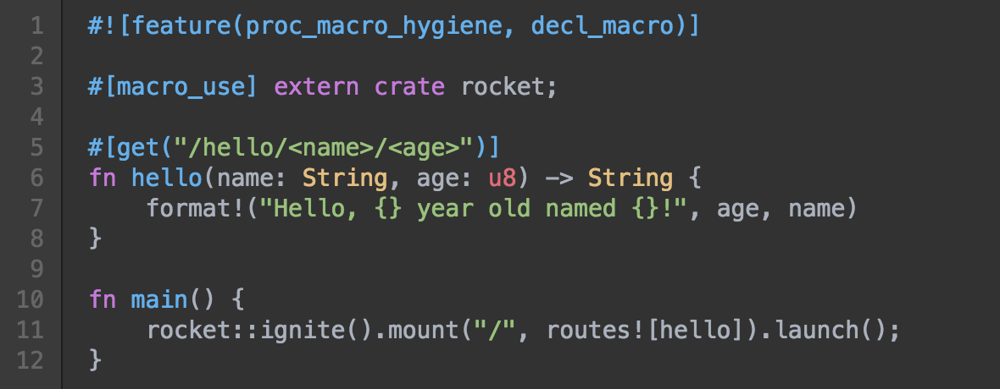

@title[A case for rust]

@snap[midpoint text-center slide1 span-60]
<h1>A case for Rust</h1>
Boot-loaders
<br/>to
<br/>Browser-applications.
@snapend


@snap[south-east author-box]
@fa[envelope](prataprc@gmail.com - R Pratap Chakravarthy) <br/>
@snapend

---

Why language ?
==============

<br/>

@snap[fragment text-center]
@color[gray](A good carpenter is only as good as his tools.)
@snapend

<br/>

@snap[fragment text-center]
Programming languages are the @color[blue](#1) tool for everything that
involves a computer.
@snapend

<br/>

---

Why program ?
=============

@snap[west text-blue fragment]
Be it Algorithms
@snapend

@snap[east text-green fragment]
Be it Data mining
@snapend

@snap[mt40 center text-center text-brown fragment]
Be it Artificial Intelligence
@snapend

@snap[why-program-1 text-center fragment]
The need for programming arises because,
@snapend

@snap[why-program-2 text-center text-gray fragment]
We want to automate repetitive jobs.
@snapend

---

Gold rush ?
===========

@snap[mt60 text-center fragment]
Close to @color[blue](700+) languages are being developed and maintained in past 50 years.
@snapend

@snap[mt20 text-center fragment]
Some of them are dead.
@snapend

@snap[mt20 text-center fragment]
@color[gray](Is this a gold rush ? Or some thing else ?)
@snapend

---

Not a gold rush! Just market
============================

@snap[mt20 size-80 text-center fragment]
@quote[Over time a market will split into two or more markets.](Immutable laws of marketing)
@snapend

@snap[mt20 text-center fragment]
Market for automating repetitive jobs are no different.
@snapend

@snap[mt20 text-center fragment]
Program automata are nuanced and when the demand for
@color[gray](efficiency) and @color[gray](quality) is adequately pronounced
for a particular automata
@snapend

@snap[mt20 text-blue text-center fragment]
The market shall split !
@snapend

Note:
- Give an example

---

The dilemma
===========

<br/>
@snap[text-gray fragment]
Learn a dozen language to become a good carpenter.
@snapend

@snap[mt20 fragment]
OR
@snapend

@snap[mt20 text-green fragment]
Just one language and be stuck in the same workshop
@snapend

---

Neither !
=========

@snap[mt20 text-center fragment]
Let us break down programming languages. See what is making the case
for a good language.
@snapend

@ul[mt20 size-80]
- @color[blue](Crash free), no blue screen, no freeze, no reboot.
- @color[blue](Performance), one step ahead of every human reaction.
- @color[blue](Strong type system), to tame complexity.
- @color[blue](Expressive), for us, between us.
- @color[blue](Predictable), there shall be no surprises.
- @color[blue](Productive), from prototype to production before the attention is lost.
@ulend

---

Crash free
==========

@snap[north-west joker fragment]

@snapend

@snap[joker-line west fragment]
Out of control
@snapend

@snap[north-east batman fragment]

@snapend

@snap[batman-line east fragment]
Garbage collector
@snapend

@ul[crash-free]
- @color[blue](C) can give programmer total freedom, free as in @color[red](you can shoot yourself all you want) free.
- @color[blue](Python), @color[blue](Java), @color[blue](Javascript) etc.. has garbage collector for safety, and sadly, the garbage collector doesn't know that he is a bad influence.
@ulend

+++

Safe programs
=============

@snap[mt30 fragment text-center]
With @color[red](great power) comes @color[red](great mistakes).
@snapend

<table class="mt30 size-60">
	<tr><td class="text-blue text-left fragment"> Dangling pointers </td>
	    <td class="text-gray text-left fragment"> When allocated memory is not freed </td>
    </tr>
	<tr><td class="text-blue text-left fragment"> Double free </td>
	    <td class="text-gray text-left fragment"> When allocated memory is freed twice </td>
    </tr>
	<tr><td class="text-blue text-left fragment"> Segmentation fault </td>
	    <td class="text-gray text-left fragment"> When a pointer goes bad and steps into protected memory </td>
    </tr>
	<tr><td class="text-blue text-left fragment"> Out-of-bound index </td>
	    <td class="text-gray text-left fragment"> When overflowing index operation corrupts stack or heap</td>
    </tr>
	<tr><td class="text-blue text-left fragment"> Data race </td>
	    <td class="text-gray text-left fragment"> When multiple threads try to read/write the same value </td>
    </tr>
</table>

@snap[mt30 text-center fragment]
In Rust, enjoy the raw performance without @color[blue](alloc) and
@color[blue](free). Delegate power to unsafe functions.
@snapend

---

Performance
===========

@ul[mt20 size-80 fragment]
* With millions of transistors packed in a micro-chip
* With ever increasing Gigabytes of Memory
@ulend

@snap[size-80 text-gray fragment]
Response time of 30ms is barely noticed over response time of 10ms.
@snapend

@snap[mt20 size-80 fragment]
But then,
@snapend

@snap[mt20 size-80 fragment]
Wireless networks and lithium batteries are adding a new
dimension to computing - @css[text-blue fragment](mobility).
@snapend

@ul[mt30 size-80]
* With 1/3rd of the transistors.
* With 1/3rd of the memory
* Running at 1/3rd clock rate.
@ulend

@snap[size-80 fragment]
A computers can last @color[blue](5-10 times longer) with same battery capacity.
@snapend

+++

Performance: Execution time
===========================

<canvas data-chart="line">
<!--
{
 "data": {
  "labels": [
     "reverse-complement", "k-nucleotide", "pidigits", "spectral-norm",
     "mandelbrot", "fasta", "binary-trees", "fannkuch-redux", "n-body",
     "regex-redux"
   ],
  "datasets": [
   {
    "fill": false,
    "cubicInterpolationMode": "monotone",
    "data": [1.76, 6.27, 1.75, 1.98, 1.64, 1.36, 3.72, 8.72, 9.36, 1.46 ],
    "label":"C",
    "borderColor":"crimson"
   },
   {
    "fill": false,
    "cubicInterpolationMode": "monotone",
    "data": [4.00, 13.06, 2.04, 3.95, 5.47, 2.06, 28.56, 17.83, 21.00, 28.89 ],
    "label":"Go",
    "borderColor":"green"
   },
   {
    "fill": false,
    "cubicInterpolationMode": "monotone",
    "data": [1.60, 5.98, 1.74, 1.97, 1.74, 1.46, 4.14, 9.87, 13.25, 2.44 ],
    "label":"Rust",
    "borderColor":"brown"
   },
   {
    "fill": false,
    "cubicInterpolationMode": "monotone",
    "data": [3.29, 8.66, 3.13, 4.27, 6.96, 2.32, 8.28, 17.91, 22, 10.52 ],
    "label":"Java",
    "borderColor":"cyan"
   }
  ]
 }, 
 "options": { "responsive": "true" }
}
-->
</canvas>

@snap[mt20 size-60]
Courtesy: https://benchmarksgame-team.pages.debian.net/benchmarksgame
@snapend

+++

Performance: Memory
===================

<canvas data-chart="line">
<!--
{
 "data": {
  "labels": [
     "reverse-complement", "k-nucleotide", "pidigits", "spectral-norm",
     "mandelbrot", "fasta", "binary-trees", "fannkuch-redux", "n-body",
     "regex-redux"
   ],
  "datasets": [
   {
    "fill": false,
    "cubicInterpolationMode": "monotone",
    "data": [995212, 137956, 4520, 2600, 33712, 3112, 175692, 1848, 1808, 194804 ],
    "label":"Rust",
    "borderColor":"brown"
   },
   {
    "fill": false,
    "cubicInterpolationMode": "monotone",
    "data": [994524, 130024, 2708, 1160, 26188, 2920, 117408, 916, 1088, 152124 ],
    "label":"C",
    "borderColor":"crimson"
   },
   {
    "fill": false,
    "cubicInterpolationMode": "monotone",
    "data": [826668, 148316, 8964, 2664, 31040, 3432, 466636, 1480, 1536, 338812 ],
    "label":"Go",
    "borderColor":"green"
   },
   {
    "fill": false,
    "cubicInterpolationMode": "monotone",
    "data": [724008, 385768, 37324, 32960, 76748, 42556, 982224, 31560, 32496, 637380],
    "label":"Java",
    "borderColor":"cyan"
   }
  ]
 }, 
 "options": { "responsive": "true" }
}
-->
</canvas>

@snap[mt20 size-60]
Courtesy: https://benchmarksgame-team.pages.debian.net/benchmarksgame
@snapend

+++

Performance: Source lines
=========================

<canvas data-chart="line">
<!--
{
 "data": {
  "labels": [
     "reverse-complement", "k-nucleotide", "pidigits", "spectral-norm",
     "mandelbrot", "fasta", "binary-trees", "fannkuch-redux", "n-body",
     "regex-redux"
   ],
  "datasets": [
   {
    "fill": false,
    "cubicInterpolationMode": "monotone",
    "data": [1376, 1648, 1366, 1126, 1332, 1906, 721, 1020, 1805, 765 ],
    "label":"Rust",
    "borderColor":"brown"
   },
   {
    "fill": false,
    "cubicInterpolationMode": "monotone",
    "data": [1438, 1506, 452, 1139, 1135, 2268, 836, 910, 1490, 1397 ],
    "label":"C",
    "borderColor":"crimson"
   },
   {
    "fill": false,
    "cubicInterpolationMode": "monotone",
    "data": [611, 1722, 603, 548, 905, 1358, 654, 900, 1200, 802],
    "label":"Go",
    "borderColor":"green"
   },
   {
    "fill": false,
    "cubicInterpolationMode": "monotone",
    "data": [2183, 1812, 938, 950, 796, 2473, 835, 1282, 1489, 929],
    "label":"Java",
    "borderColor":"cyan"
   }
  ]
 },
 "options": { "responsive": "true" }
}
-->
</canvas>

@snap[mt20 size-60]
Courtesy: https://benchmarksgame-team.pages.debian.net/benchmarksgame
@snapend

---

Strong type system
==================

@snap[mt20 size-80 text-center fragment]
Ask a programmer, where the longest hours are spent ...
@snapend

<table class="mt30 size-80">
  <tr>
    <td class="fragment"> Design ? </td>
    <td class="fragment"> Implementation ? </td>
    <td class="fragment"> Testing ? </td>
   </tr>
</table>

@snap[mt20 text-center size-80 fragment]
As it happens most of the hard-work goes into
@snapend
@snap[mt20 text-center fragment]
@size[2em](Debugging!!)
@snapend
@snap[mt20 text-center fragment]
Not just today or yesterday, but ever since software programs got developed.
@snapend

+++

Fix the bugs
============

@snap[mt20 size-90 text-center fragment]
To fix the bugs, first find the bugs.
@snapend

@snap[mt20 size-90 text-center fragment]
How to find the bugs ?
@snapend

<table class="mt30  text-center size-80">
  <tr>
    <td class="fragment"> Unit testing </td> <td class="fragment"> Functional testing </td>
    <td class="fragment"> System testing </td> <td class="fragment"> Regression testing </td>
   </tr>
</table>


<div class="fragment humble-dijkstra">
@quote[Program testing can be a very effective way to show the presence of bugs, but it is hopelessly inadequate for showing their absence.](“The Humble Programmer,” Edsger W. Dijkstra)
</div>

@snap[mt20 size-90 text-center text-blue fragment]
Is there a better way ?  @css[text-green fragment](Type theory)
@snapend

+++

Finger typing
=============

@snap[mt20 size-90 text-center fragment]
Until type-theory evolved into what it is today, languages that call
them self as strongly-typed mostly did finger typing.
@snapend

@snap[mt20 size-90 text-center fragment]
That is,
@snapend

@snap[mt20 size-90 text-center fragment]
Programmers must declare the type of variable/value, before
applying specific operations on them.
@snapend

+++

Type theory
===========

@ul[mt20 size-90]
- Forging a type means, @color[blue](clear abstraction of values and its behaviours).
- When behavior of programs interact, their @color[blue](types should be aligned).
- When types are aligned, @color[blue](functions are composable).
- With composable functions, @color[blue](complexity can be tamed).
@ulend

@snap[mt20 size-90 fragment]
In Rust,
@css[text-green fragment](Lifetime,)
@css[text-green fragment](Ownership,)
@css[text-green fragment](Mutability)
@css[fragment](all come together with its strong type-system.)
@snapend

+++

<!-- .slide: class="size-90" -->

Surprise 1: Sorting NaN
=======================

As per the floating point spec, NaN and Inf are allowed. Now let us try
to sort a list of floating point numbers, intermixed with NaN.

In python

```python
>>> sorted([3, 4, float('NaN'), 1, 2])
[3, 4, nan, 1, 2]
>>> sorted([3,4,1,2])
[1, 2, 3, 4]
```

@snap[mt20 fragment]
Rust,
@css[fragment](don't allow sorting floating point numbers !! It simply doesn’t define @color[blue](Ord) trait for floats.)
@snapend

---

Expressive
==========

@snap[mt20 size-90 text-center fragment]
Computers communicate in @color[gray](1s) and @color[gray](0s).
@snapend
@snap[size-90 text-center fragment]
Humans communicate with @color[gray](symbols) and @color[gray](syllables).
@snapend

@snap[mt20 size-90 text-center fragment]
A program, first and foremost, is used as a record
to communicate with other programmers and most often
with its author. @css[fragment](Only when compiled, to 1s and 0s, computers can understand the program.)
@snapend

@snap[mt20 size-90 text-center fragment]
Midway between 1s/0s and symbols/syllables ?
@snapend

<table class="mt20">
  <tr>
	<td class="fragment"> Context Free Grammar </td>
	<td class="fragment"> keywords, identifiers and comments </td>
	<td class="fragment"> domain specific syntax </td>
	<td class="fragment"> type theory </td>
  </tr>
</table>

+++

Example: Ruby Vs Rust
========================

<h3 class="size-90 text-center">Ruby</h3>

```ruby
irb(main):002:0> Time.now - 2.days
=> 2009-12-26 09:57:02 -0800
irb(main):003:0> 2.days.ago
=> 2009-12-26 09:57:04 -0800
```

----------

<h3 class="size-90 text-center">Rust</h3>

```rust
fn main() {
  let time = Time::now();
  println!("{:?}", time);
  println!("{:?}", 2.days().from_now());
  println!("{:?}", 2.weeks().from_now());
  println!("{:?}", 2.months().from_now());
  println!("{:?}", 2.years().from_now());
}
```

+++

Example: Scala Vs Rust
======================

Increment every number in a array/list by 5.

<h3 class="size-90 text-center">Scala</h3>

```scala
val anotherList = someList.map(x => x + 5)
```

--------------

<h3 class="size-90 text-center">Rust</h3>

```rust
let another: Vec<u64> = some_vec.iter().map(|x|x + 5).collect();
```

+++

@title[Gets better]

@snap[midpoint]
<h1> It gets better </h1>
@snapend

+++

A simple web-server
===================



@snap[text-center]
A simple web server to welcome its visitor.
@snapend

+++

Domain specific: LALR
=====================

Can a parser get more clear and concise that this ?

```bnf
csv      : csv-line
         | csv-line '\n'
         | csv-line '\n' csv-line.
csv-line : value
         | csv-line ',' value.
value    : INT_LITERAL.
```

Above is an example for parsing Comma separated numbers using LALR grammar -
a domain specific language to generate parser.

+++

<!-- .slide: class="nom-csv" -->

Domain specific: Rust
=====================

@snap[mt20 size-60]
Same parser in rust, without compromising on performance !! Domain specific macros ..
@snapend

```rust
named!(comma(NS)   -> NS, ws!(tag!(",")));
named!(newline(NS) -> NS, ws!(tag!("\n")));
named!(value(NS)   -> isize,
    flat_map!(ws!(re_find!(r#"^[+-]?\d+"#)), parse_to!(isize))
);
named!(commavalue(NS) -> isize,
    do_parse!(
             comma >>
        val: value >>
        (val)
    )
);
named!(line(NS) -> (isize, Vec<isize>),
	do_parse!(
		 item: value              >>
		items: many0!(commavalue) >>
		(item, items)
	),
);
named!(nextline(NS) -> (isize, Vec<isize>),
    do_parse!(
             newline >>
        val: value     >>
        (val)
    )
);
named!(lines(NS) -> Vec<(isize, Vec<isize>)>,
	do_parse!(
		 item: line              >>
		items: many0!(nextline) >>
		(item, items)
	),
);
```

---

<!-- .slide: class="size-80" -->

Predictable
===========

@snap[fragment]
Programs are used in :
@snapend

@ul[mt20]
- Engines and brakes in a car.
- Lifts and security systems in a building.
- Assembly line of factory.
- Robotics.
- Medical instruments, surgical tools.
@ulend

@snap[mt20 fragment]
Sometimes @color[blue](predictable response time)
is as important as the correctness of computer programs.
@snapend

+++

Achilles heal
=============

@css[text-bold fragment](WYSMNWYG) @css[fragment](-- What You See May Not What You Get)

@snap[text-center fragment text-green]
Why ?
@snapend

@ul[mt30]
- Garbage collection.
- Abstraction overhead.
- Runtime scheduler.
@ulend

@snap[mt30 text-center fragment]
When **things** happen inbetween the lines of code
@snapend

@snap[text-center text-blue fragment]
It gets harder to predict
@snapend

+++

<!-- .slide: class="size-90" -->

Garbage collection
==================

<br/>

@snap[text-center fragment]
Memory gets managed at compile time
@snapend

@snap[text-center mt30 fragment]
No allocs and no frees
@snapend

@snap[text-center mt30 fragment]
No Garbage to collect.
@snapend

@snap[text-center mt30 fragment]
No stop-the-word surprises.
@snapend

+++

Abstraction overhead
====================

@snap[size-80 java-abstraction fragment]
@css[size-60](Courtesy: image used from a presentation by Aaron Turon.)

The cost of abstraction in Java.
@snapend

@snap[mt20 size-80 fragment]
Rust - uses zero-cost-abstraction model, like mono-morphisation.
The only abstraction that happens behind a pointer is trait-object.
@snapend

+++

<!-- .slide: class="size-80" -->

Runtime scheduler
=================

Languages like Erlang, Golang has increased the popularity of
concurrent programming. As a side effect erlang-programs and
golang-programs introduce a @color[blue](scheduler as part of the running process),
to handle @color[blue](green-threads).

An example side-effect:

```go
func main() {
	runtime.GOMAXPROCS(1)
	go func() {
		for true {
			// noop
		}
	}()

	for true {
		fmt.Printf("Hello world!\n")
		time.Sleep(1 * time.Millisecond)
	}
}
```

---

<!-- .slide: class="size-80" -->

Productive
==========

@snap[fragment]
With all things being equal, how productivity differ between languages ?
@css[fragment](As it happens, most of the productivity comes from features like,)
@snapend

@ul[mt20]
* Garbage collection, @css[text-red](not suitable for real-time systems.)
* Duck typing, @css[text-red](performance is bad.)
@ulend

@snap[mt20 fragment]
Rust increases productivity through,
@snapend
@ul
- Enumerated types.
- Type parameters.
- Powerful macro system.
@ulend
@snap[mt20 fragment text-green]
Without compromising on program correctness and performance
@snapend

+++

C: Palindrom for string type
============================

```c
void isPalindrome(char str[])
{
    int l = 0;
    int h = strlen(str) - 1;

    while (h > l)
    {
        if (str[l++] != str[h--])
        {
            printf("%s is Not Palindrome", str);
            return;
        }
    }
    printf("%s is palindrome", str);
}
```

+++

C: Palindrome for integer type
==============================

```c
int palindrome(int arr[], int begin, int end)
{
    if (begin >= end) {
        return 1;
    }
    if (arr[begin] == arr[end]) {
        return palindrome(arr, begin + 1, end - 1);
    }
    else {
        return 0;
    }
}
```

+++

C: Palindrome for float type
============================

```c
int palindrome(float arr[], int begin, int end)
{
    if (begin >= end) {
        return 1;
    }
    if (arr[begin] == arr[end]) {
        return palindrome(arr, begin + 1, end - 1);
    }
    else {
        return 0;
    }
}
```

+++

<!-- .slide: class="size-80" -->

Rust: Palindrome for all types
==============================

<br>

```rust
pub fn is_palindrome<T: Eq>(x: &[T]) -> bool {
    let i = x.len()/2;
    (&x[..i]).iter().zip((&x[i..]).iter().rev()).all(|(a,b)| a == b)
}
```

<br>

@snap[mt20 fragment]
Irrespective of whether we are operating on chars, numbers, floats or
any other data-type, as long as the type has @color[blue](Eq) trait,
we can solve the problem of palindrome, @css[fragment](short and sweet.)
@snapend

---

<!-- .slide: class="size-80" -->

Feature comparison
==================

<br/>

<table>
  <tr>
    <th>Language </th> <th>Safe</th> <th>Performance </th> <th>Strongtype </th> <th>Expressive </th> <th>Predictable </th> <th>Productive </th>
  </tr>
  <tr class="fragment">
    <td> C </td> <th> </th> <th> &#10004; </th> <th> </th> <th> </th> <th> &#10004; </th> <th> </th>
  </tr>
  <tr class="fragment">
    <td> C++ </td> <th> </th> <th> &#10004; </th> <th> &#10004; </th> <th> </th> <th> &#10004; </th> <th> &#10004; </th>
  </tr>
  <tr class="fragment">
    <td> C# </td> <th> &#10004; </th> <th>  </th> <th> &#10004; </th> <th> &#10004; </th> <th> </th> <th> &#10004; </th>
  </tr>
  <tr class="fragment">
    <td> Go </td> <th> &#10004; </th> <th> </th> <th> </th> <th> </th> <th> </th> <th> &#10004; </th>
  </tr>
  <tr class="fragment" style="background: #f0f0f0;">
    <td> Rust </td> <th> &#10004; </th> <th> &#10004; </th> <th> &#10004; </th> <th> &#10004; </th> <th> &#10004; </th> <th> &#10004; </th>
  </tr>
  <tr class="fragment">
    <td> Java </td> <th> &#10004; </th> <th> </th> <th> &#10004; </th> <th> &#10004; </th> <th> </th> <th> &#10004; </th>
  </tr>
  <tr class="fragment">
    <td> Haskell </td> <th> &#10004; </th> <th> </th> <th> &#10004; </th> <th> &#10004; </th> <th> </th> <th> &#10004; </th>
  </tr>
</table>

---

What we can do with Rust ?
==========================

<table class="size-50">
<tr><th> Doing what    </th> <th> Rust     </th> <th> C        </th> <th> Python   </th> <th> Java     </th> <th> Golang   </th> <th> C#       </th> <th> Swift    </th> <th> js       </th> </tr>
<tr class="fragment"><td> Boot loader   </td> <td> &#10004; </td> <td> &#10004; </td> <td>          </td> <td>          </td> <td>          </td> <td>          </td> <td>          </td> <td>          </td> </tr>
<tr class="fragment"><td> Firmware      </td> <td> &#10004; </td> <td> &#10004; </td> <td>          </td> <td>          </td> <td>          </td> <td>          </td> <td>          </td> <td>          </td> </tr>
<tr class="fragment"><td> Kernel        </td> <td> &#10004; </td> <td> &#10004; </td> <td>          </td> <td>          </td> <td>          </td> <td>          </td> <td>          </td> <td>          </td> </tr>
<tr class="fragment"><td> Script        </td> <td> &#10004; </td> <td>          </td> <td> &#10004; </td> <td>          </td> <td> &#10004; </td> <td> &#10004; </td> <td>          </td> <td> &#10004; </td> </tr>
<tr class="fragment"><td> Middleware    </td> <td> &#10004; </td> <td> &#10004; </td> <td> &#10004; </td> <td> &#10004; </td> <td> &#10004; </td> <td> &#10004; </td> <td> &#10004; </td> <td> &#10004; </td> </tr>
<tr class="fragment"><td> Algorithms    </td> <td> &#10004; </td> <td> &#10004; </td> <td>          </td> <td> &#10004; </td> <td> &#10004; </td> <td> &#10004; </td> <td> &#10004; </td> <td> &#10004; </td> </tr>
<tr class="fragment"><td> Database      </td> <td> &#10004; </td> <td> &#10004; </td> <td>          </td> <td> &#10004; </td> <td> &#10004; </td> <td>          </td> <td> &#10004; </td> <td>          </td> </tr>
<tr class="fragment"><td> Web-stack     </td> <td> &#10004; </td> <td> &#10004; </td> <td> &#10004; </td> <td> &#10004; </td> <td> &#10004; </td> <td> &#10004; </td> <td> &#10004; </td> <td> &#10004; </td> </tr>
<tr class="fragment"><td> Browser <span style="color: gray;">\*</span> </td> <td> &#10004; </td> <td>          </td> <td>          </td> <td>          </td> <td>          </td> <td>          </td> <td>          </td> <td> &#10004; </td> </tr>
<tr class="fragment"><td> Windows       </td> <td> &#10004; </td> <td> &#10004; </td> <td> &#10004; </td> <td> &#10004; </td> <td> &#10004; </td> <td> &#10004; </td> <td>          </td> <td> &#10004; </td> </tr>
<tr class="fragment"><td> OSX           </td> <td> &#10004; </td> <td> &#10004; </td> <td> &#10004; </td> <td> &#10004; </td> <td> &#10004; </td> <td>          </td> <td> &#10004; </td> <td> &#10004; </td> </tr>
<tr class="fragment"><td> Android / iOS <span style="color: gray;">\*</span> </td> <td> &#10004; </td> <td>          </td> <td>          </td> <td> &#10004; </td> <td> &#10004; </td> <td>          </td> <td> &#10004; </td> <td>          </td> </tr>
</table>

@snap[size-50 text-gray south fragment]
<span style="color: gray;">\*</span> encouraging work in progress
@snapend

---

Rust and C
==========

@snap[mt20 size-80 fragment]
Rust maintains the C like philosophy through and through, to enable
programmers with small, but powerful set of features that can inter-play
with each other seamlessly.
@snapend

<style> table th, table td { text-align: center !important; } </style>

<table class="size-60 south-west">
  <tr class="fragment">
    <th style="color: blue;"> Feature </th> <th> C </th> <th> Rust </th>
  </tr>
  <tr class="fragment">
    <td> Hardware access </td> <td class="text-blue"> Y </td> <td class="text-blue"> Y </td>
  </tr>
  <tr class="fragment">
    <td> Pointers </td> <td class="text-blue"> Y </td> <td class="text-blue"> Y </td>
  </tr>
  <tr class="fragment">
    <td> Link with C binary </td> <td class="text-blue"> Y </td> <td class="text-blue"> Y </td>
  </tr>
  <tr class="fragment">
    <td> Garbage collection </td> <td class="text-red"> N </td> <td class="text-red"> N </td>
  </tr>
  <tr class="fragment">
    <td> Zero Cost Abstraction </td> <td class="text-blue"> Y </td> <td class="text-blue"> Y </td>
  </tr>
  <tr class="fragment">
    <td> LLVM Backend </td> <td class="text-blue"> Y </td> <td class="text-blue"> Y </td>
  </tr>
  <tr class="fragment">
    <td> Standard Library </td> <td class="text-blue"> Y </td> <td class="text-blue"> Y </td>
  </tr>
  <tr class="fragment">
    <td> Memory safety </td> <td class="text-red"> N </td> <td class="text-blue"> Y </td>
  </tr>
</table>

<table class="size-60 south-east">
  <tr class="fragment">
    <th style="color: blue;"> Feature </th> <th> C </th> <th> Rust </th>
  </tr>
  <tr class="fragment">
    <td> Type inference </td> <td class="text-red"> N </td> <td class="text-blue"> Y </td>
  </tr>
  <tr class="fragment">
    <td> Parametric types </td> <td class="text-red"> N </td> <td class="text-blue"> Y </td>
  </tr>
  <tr class="fragment">
    <td> Mono-morphisation </td> <td class="text-red"> N </td> <td class="text-blue"> Y </td>
  </tr>
  <tr class="fragment">
    <td> Enumerated types </td> <td class="text-red"> N </td> <td class="text-blue"> Y </td>
  </tr>
  <tr class="fragment">
    <td> Pattern matching </td> <td class="text-red"> N </td> <td class="text-blue"> Y </td>
  </tr>
  <tr class="fragment">
    <td> Macros </td> <td class="text-red"> N </td> <td class="text-blue"> Y </td>
  </tr>
  <tr class="fragment">
    <td> Closures </td> <td class="text-red"> N </td> <td class="text-blue"> Y </td>
  </tr>
  <tr class="fragment">
    <td> Build and packaging </td> <td class="text-red"> N </td> <td class="text-blue"> Y </td>
  </tr>
</table>

---

@snap[midpoint]
<h1>Thank you</h1>
@snapend
